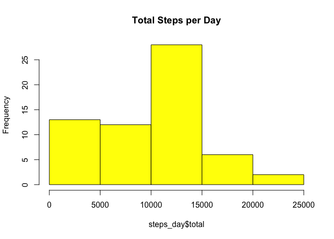
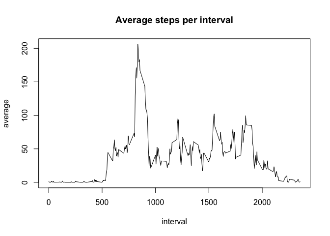
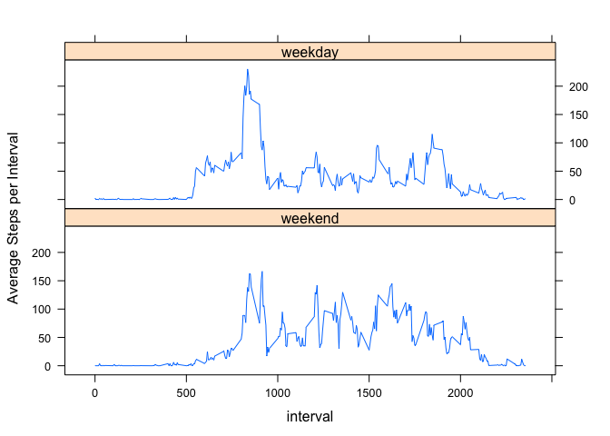

# Reproducible Research: Peer Assessment 1

## Loading and preprocessing the data

Show any code that is needed to

1. Load the data


```r
act_dfm <- read.csv("activity.csv")
```

2. Process/transform the data (if necessary) into a format suitable for your analysis

Group data frame by date


```r
library(dplyr)
```

```
## 
## Attaching package: 'dplyr'
```

```
## The following objects are masked from 'package:stats':
## 
##     filter, lag
```

```
## The following objects are masked from 'package:base':
## 
##     intersect, setdiff, setequal, union
```

```r
act_day <- group_by(act_dfm, date)
act_itv <- group_by(act_dfm, interval)
```

## What is mean total number of steps taken per day?

For this part of the assignment, you can ignore the missing values in
the dataset.

1. Make a histogram of the total number of steps taken each day


```r
steps_day <- summarize(act_day, total = sum(steps, na.rm = TRUE))
hist(steps_day$total, col = "yellow", main = "Total Steps per Day")
```



2. Calculate and report the **mean** and **median** total number of steps taken per day


```r
summary(steps_day$total)
```

```
##    Min. 1st Qu.  Median    Mean 3rd Qu.    Max. 
##       0    6778   10400    9354   12810   21190
```

## What is the average daily activity pattern?

1. Make a time series plot (i.e. `type = "l"`) of the 5-minute interval (x-axis) and the average number of steps taken, averaged across all days (y-axis)


```r
steps_interval <- summarize(act_itv, average = mean(steps, na.rm = TRUE))

plot(average ~ interval, steps_interval, type = "l", 
     main = "Average steps per interval")
```



2. Which 5-minute interval, on average across all the days in the dataset, contains the maximum number of steps?


```r
with(steps_interval, interval[which.max(average)])
```

```
## [1] 835
```

## Imputing missing values

Note that there are a number of days/intervals where there are missing
values (coded as `NA`). The presence of missing days may introduce
bias into some calculations or summaries of the data.

1. Calculate and report the total number of missing values in the dataset (i.e. the total number of rows with `NA`s)


```r
summary(act_dfm)
```

```
##      steps                date          interval     
##  Min.   :  0.00   2012-10-01:  288   Min.   :   0.0  
##  1st Qu.:  0.00   2012-10-02:  288   1st Qu.: 588.8  
##  Median :  0.00   2012-10-03:  288   Median :1177.5  
##  Mean   : 37.38   2012-10-04:  288   Mean   :1177.5  
##  3rd Qu.: 12.00   2012-10-05:  288   3rd Qu.:1766.2  
##  Max.   :806.00   2012-10-06:  288   Max.   :2355.0  
##  NA's   :2304     (Other)   :15840
```

```r
sum(is.na(act_dfm$steps))
```

```
## [1] 2304
```

2. Devise a strategy for filling in all of the missing values in the dataset. The strategy does not need to be sophisticated. For example, you could use the mean/median for that day, or the mean for that 5-minute interval, etc.


3. Create a new dataset that is equal to the original dataset but with the missing data filled in.


```r
act_mod <- act_day
for (chDay in levels(steps_day$date)) {
        iDay <- which(act_mod$date == chDay & is.na(act_mod$steps))
        iItv <- steps_interval$interval == act_mod$interval[iDay]
        act_mod$steps[iDay] <- round(steps_interval$average[iItv])
}
```

4. Make a histogram of the total number of steps taken each day and Calculate and report the **mean** and **median** total number of steps taken per day. Do these values differ from the estimates from the first part of the assignment? What is the impact of imputing missing data on the estimates of the total daily number of steps?


```r
steps_day_mod <- summarize(act_mod, total = sum(steps, na.rm = TRUE))
hist(steps_day_mod$total, col = "yellow", 
     main = "Total Steps per Day (modified)")
```


```r
summary(steps_day_mod$total)
```

```
##    Min. 1st Qu.  Median    Mean 3rd Qu.    Max. 
##      41    9819   10760   10770   12810   21190
```

```r
( stepsDiff <- sum(steps_day_mod$total) - sum(steps_day$total) )
```

```
## [1] 86096
```

```r
stepsDiff / sum(steps_day$total)
```

```
## [1] 0.1508847
```

## Are there differences in activity patterns between weekdays and weekends?

For this part the `weekdays()` function may be of some help here. Use
the dataset with the filled-in missing values for this part.

1. Create a new factor variable in the dataset with two levels -- "weekday" and "weekend" indicating whether a given date is a weekday or weekend day.


```r
wkDays <- c("Monday", "Tuesday", "Wednesday", "Thursday", "Friday")
act_mod$weekday <- factor(weekdays(as.Date(act_day$date)) %in% wkDays,
                          labels=c("weekend", "weekday"))
```

1. Make a panel plot containing a time series plot (i.e. `type = "l"`) of the 5-minute interval (x-axis) and the average number of steps taken, averaged across all weekday days or weekend days (y-axis). 


```r
act_itv_mod <- group_by(act_mod, weekday, interval)
steps_itv_mod <- summarize(act_itv_mod, average = mean(steps))

library(lattice)
xyplot(average ~ interval | weekday, data = steps_itv_mod, 
       layout = c(1, 2), type = "l", ylab = "Average Steps per Interval")
```


