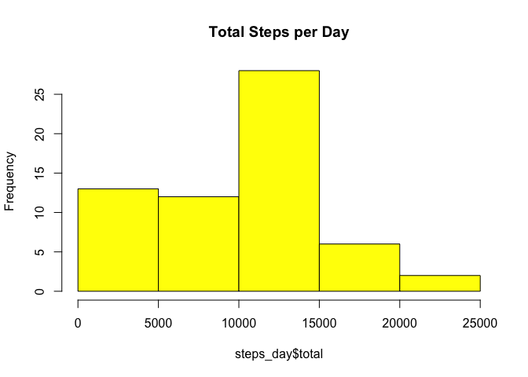
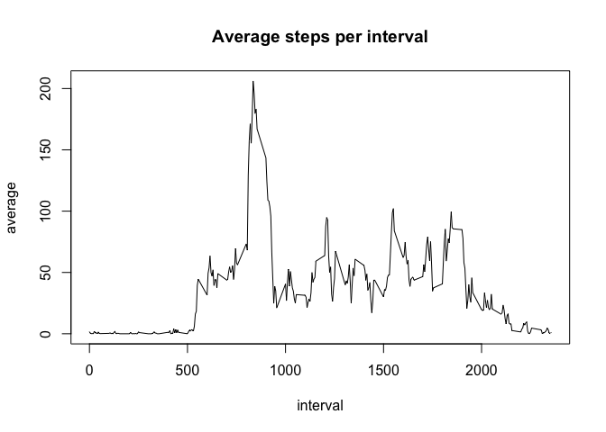
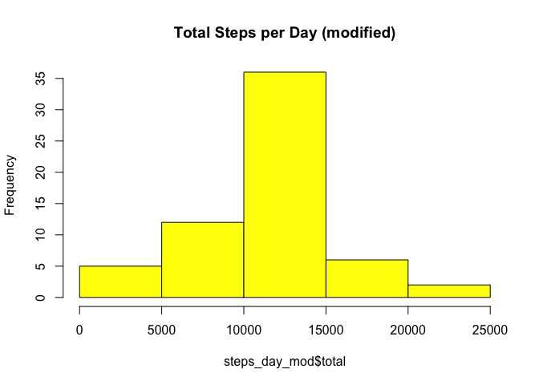
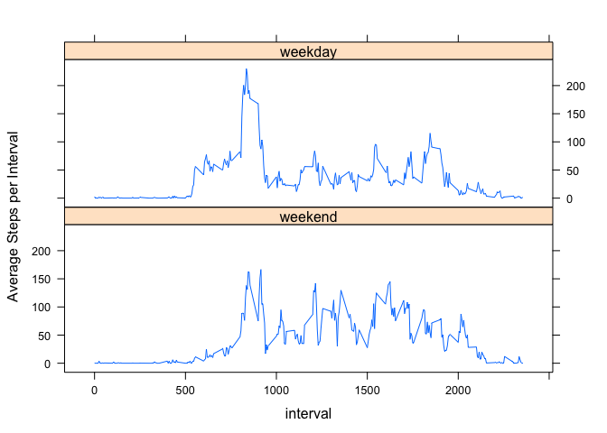

# Reproducible Research: Peer Assessment 1

Notes: 

1. Markdown written and knitted in RStudio
2. Original figures folder `PA1_template_files/figure-html` copied to `figure`

### Loading and preprocessing the data

1. Data loaded from csv file


```r
act_dfm <- read.csv("activity.csv")
```

2. Data frame grouped  by date or interval


```r
library(dplyr)
```

```r
act_day <- group_by(act_dfm, date)
act_itv <- group_by(act_dfm, interval)
```

### What is mean total number of steps taken per day?

Data preview and summary **ignoring missing values**.

1. Histogram of the total number of steps taken each day


```r
steps_day <- summarize(act_day, total = sum(steps, na.rm = TRUE))
hist(steps_day$total, col = "yellow", main = "Total Steps per Day")
```



2. **Mean** and **median** total number of steps taken per day


```r
summary(steps_day$total)
```

```
##    Min. 1st Qu.  Median    Mean 3rd Qu.    Max. 
##       0    6778   10400    9354   12810   21190
```

### What is the average daily activity pattern?

1. Time series plot of the 5-minute interval (x-axis) and the average number of steps taken, averaged across all days (y-axis)


```r
steps_interval <- summarize(act_itv, average = mean(steps, na.rm = TRUE))
plot(average ~ interval, steps_interval, type = "l", 
     main = "Average steps per interval")
```



2. Which 5-minute interval, on average across all the days in the dataset, contains the maximum number of steps?


```r
with(steps_interval, interval[which.max(average)])
```

```
## [1] 835
```

### Imputing missing values

1. Total number of missing values in the dataset.


```r
summary(act_dfm)
```

```
##      steps                date          interval     
##  Min.   :  0.00   2012-10-01:  288   Min.   :   0.0  
##  1st Qu.:  0.00   2012-10-02:  288   1st Qu.: 588.8  
##  Median :  0.00   2012-10-03:  288   Median :1177.5  
##  Mean   : 37.38   2012-10-04:  288   Mean   :1177.5  
##  3rd Qu.: 12.00   2012-10-05:  288   3rd Qu.:1766.2  
##  Max.   :806.00   2012-10-06:  288   Max.   :2355.0  
##  NA's   :2304     (Other)   :15840
```

```r
sum(is.na(act_dfm$steps))
```

```
## [1] 2304
```

Missing values are present only in column _steps_

2. Strategy for filling in all of the missing values in the dataset:   **Replace missing values in a given interval with the average for that interval over all days.**

3. Create a new dataset that is equal to the original dataset but with the missing data filled in


```r
act_mod <- act_day
for (chDay in levels(steps_day$date)) {
        iDay <- which(act_mod$date == chDay & is.na(act_mod$steps))
        iItv <- steps_interval$interval == act_mod$interval[iDay]
        act_mod$steps[iDay] <- round(steps_interval$average[iItv])
}
```

4. Histogram of the total number of steps taken each day (modified data frame with replaced missing values)


```r
steps_day_mod <- summarize(act_mod, total = sum(steps, na.rm = TRUE))
hist(steps_day_mod$total, col = "yellow", 
     main = "Total Steps per Day (modified)")
```



**Mean** and **median** total number of steps taken per day. 


```r
summary(steps_day_mod$total)
```

```
##    Min. 1st Qu.  Median    Mean 3rd Qu.    Max. 
##      41    9819   10760   10770   12810   21190
```

```r
( stepsDiff <- sum(steps_day_mod$total) - sum(steps_day$total) )
```

```
## [1] 86096
```

```r
stepsDiff / sum(steps_day$total)
```

```
## [1] 0.1508847
```

Replacing missing data results in **86,096** additional steps, an increase of roughly 15%.


### Are there differences in activity patterns between weekdays and weekends?

1. Added a factor variable with levels "weekday" and "weekend" according to the actual day of the week.


```r
wkDays <- c("Monday", "Tuesday", "Wednesday", "Thursday", "Friday")
act_mod$weekday <- factor(weekdays(as.Date(act_day$date)) %in% wkDays,
                          labels=c("weekend", "weekday"))
```

1. Panel plot containing a time series plot of the 5-minute interval (x-axis) and the average number of steps taken, averaged across all _weekday_ days or _weekend_ days (y-axis). 


```r
act_itv_mod <- group_by(act_mod, weekday, interval)
steps_itv_mod <- summarize(act_itv_mod, average = mean(steps))

library(lattice)
xyplot(average ~ interval | weekday, data = steps_itv_mod, 
       layout = c(1, 2), type = "l", ylab = "Average Steps per Interval")
```



The plot shows the different patterns on weekdays and weekends.  On weekends, walking starts with a step change around interval 500.  The peak activity during weedays is 230 steps while on weekend it's 166.  But the mean over all intervals is higher on weekends (42.3 v 35.6), indicating less overall activity during the week.
